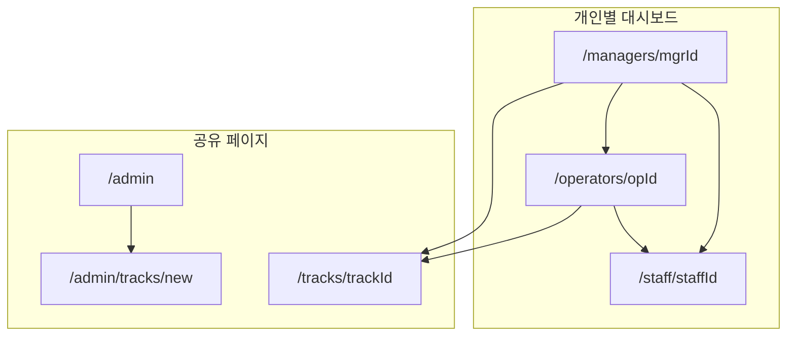
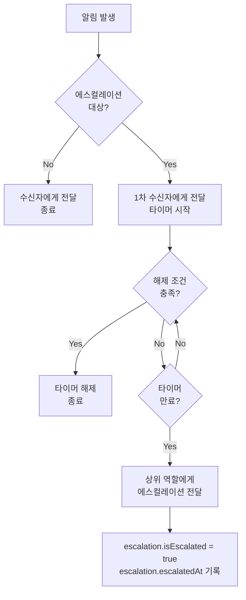
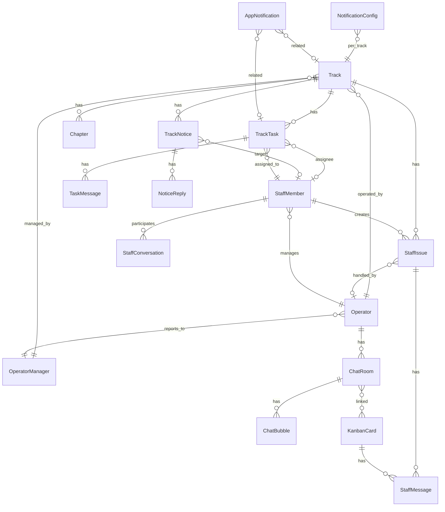
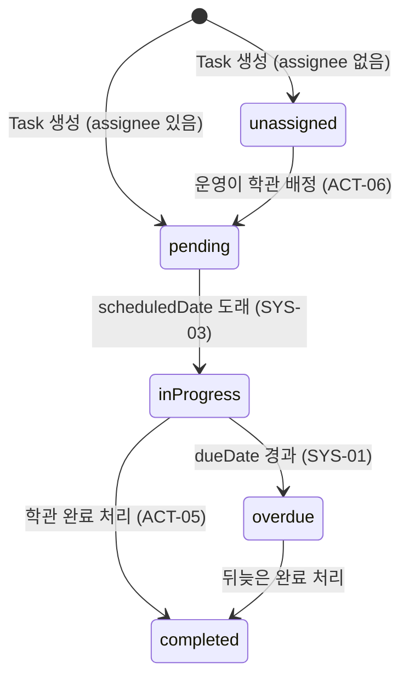
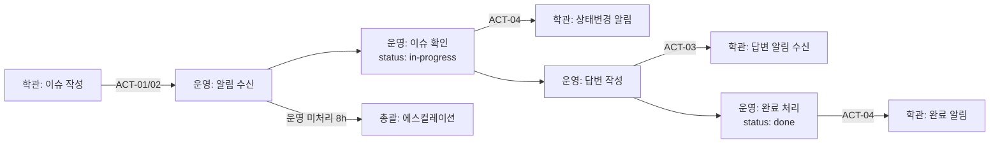
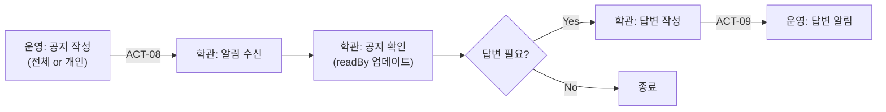
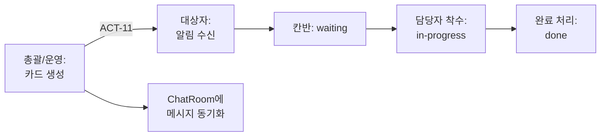

# Track Dashboard - 프로젝트 컨텍스트 문서

> 이 문서는 프로젝트의 목적, 구조, 구현된 기능, 설계 결정 사항을 정리한 것입니다.
> 새로 합류하는 사람이나 AI 에이전트가 맥락을 빠르게 파악할 수 있도록 작성되었습니다.

---

## 1. 프로젝트 목적

**학습 트랙 운영 관리 대시보드 시스템**

교육 프로그램(트랙)의 운영을 체계화하여:
- **학습관리매니저(학관)** 자리에 누가 와도 퀄리티를 유지할 수 있도록, 미리 정의된 Task를 자동 배정하고 팔로업이 가능한 구조를 만든다
- **운영기획매니저(총괄)** 의 리소스를 대폭 절감하여, 기본적인 운영이 잘 돌아가는지 지표만 보고도 확신할 수 있게 한다

### 사용자 역할 (3+1)

| 역할 키 | 풀네임 | 줄임말 | 고용형태 | 설명 |
|---------|--------|--------|----------|------|
| `operator_manager` | 운영기획매니저 | 총괄 | 정규직 | 4~5개 트랙을 총괄. 운영매니저만 관리 |
| `operator` | 운영매니저 | 운영 | 계약직 | 학관을 직접 관리. 트랙 운영 실무 |
| `learning_manager` | 학습관리매니저 | 학관 | 알바 | 수강생과 직접 소통하며 일일 Task 수행 |
| `tutor` | 튜터 | 튜터 | 선택 | 트랙에 따라 배정 여부가 다름 |

**역할 라벨은 `lib/role-labels.ts` 한 곳에서 관리.** 이름이 바뀌면 이 파일만 수정하면 전체 반영됨.

### 조직 구조
```
총괄 1명
 └─ 운영 3명
     └─ 학관 9명 (각 운영당 3명)
```

### 핵심 원칙
- 총괄은 운영만 관리하고, 운영은 학관을 관리하는 위임 구조
- 총괄은 **업무완료율(학관), 이슈처리율, 업무완료율(운영)** 3가지 지표만으로 트랙 상태를 파악
- 트랙 생성 시 시스템이 자동으로 Task를 배정하고, 일정마다 학관 개인 업무 페이지로 전달

---

## 2. 기술 스택

| 카테고리 | 기술 | 버전 |
|---------|------|------|
| 프레임워크 | Next.js (App Router) | 16.1.6 |
| UI 라이브러리 | React | 19 |
| 언어 | TypeScript | 5.7.3 |
| 상태관리 | Zustand | 5.0.11 |
| 스타일링 | Tailwind CSS + shadcn/ui | 4.x |
| DnD | @hello-pangea/dnd | 17.0.0 |
| 엑셀 파싱 | SheetJS (xlsx) | 0.18.5 |
| 날짜 | date-fns | 4.1 |
| 패키지 매니저 | pnpm | - |

### 디자인 원칙
- **무채색 중심의 미니멀 admin 디자인** (색상 4개 이상 사용 금지)
- shadcn/ui 컴포넌트 기반
- 모든 데이터는 현재 **mock 데이터** 사용

---

## 3. 디렉토리 구조

```
app/                                        # Next.js App Router 페이지
  page.tsx                                  # 학관 대시보드 (메인 페이지)
  manager/                                  # 총괄(운영기획매니저) 뷰
    page.tsx                                # 대시보드 홈
    tracks/[id]/page.tsx                    # 트랙 상세
    tracks/[id]/staff/[staffId]/page.tsx    # 학관 상세 (총괄 시점)
    operators/[id]/page.tsx                 # 운영매니저 상세
  operator/                                 # 운영매니저 뷰
    page.tsx                                # 대시보드 홈
    tracks/[id]/page.tsx                    # 트랙 상세 (운영 시점)
    tracks/[id]/staff/[staffId]/page.tsx    # 학관 상세 (운영 시점)
  admin/                                    # 시스템 관리 (설정)
    page.tsx                                # 관리 메뉴 홈
    tracks/new/page.tsx                     # 트랙 생성 위저드

components/
  layout/                     # 글로벌 레이아웃 (AppShell, AppSidebar, DebugRoleSwitcher)
  dashboard/                  # 학관 대시보드 위젯 (시간패널, 오늘할일, 캘린더, 공지, 이슈)
  interview/                  # 면담/수강생 관리 (팀 순회, 수강생 로그)
  manager/                    # 총괄 대시보드 컴포넌트
  operator/                   # 운영 대시보드 컴포넌트
  track-creation/             # 트랙 생성 위저드 (7단계)
    task-sections/            # Step 5 아코디언 섹션별 컴포넌트
  ui/                         # shadcn/ui 컴포넌트 (46개)

lib/
  role-store.ts               # 현재 역할 상태 (debug 전환용, Zustand)
  role-labels.ts              # 역할 라벨 중앙 관리 (Single Source of Truth)
  track-creation-types.ts     # 트랙 생성 관련 타입 정의
  task-templates.ts           # 63개 Task 템플릿 + 태그 분류 시스템
  task-generator.ts           # Task 자동 생성 로직
  xlsx-parser.ts              # 정부용 시간표 엑셀 파싱
  admin-mock-data.ts          # 대시보드용 mock 데이터 + 타입
  admin-store.ts              # Zustand 전역 스토어 (admin/operator 공용)
  mock-data.ts                # 학관 뷰 mock 데이터
  store.ts                    # 학관 뷰 스토어
  interview-mock-data.ts      # 면담 mock 데이터
  interview-store.ts          # 면담 스토어
```

---

## 4. 핵심 기능: 트랙 생성 위저드 (7단계)

경로: `/admin/tracks/new` (시스템 관리 하위)
컴포넌트: `components/track-creation/track-creation-wizard.tsx`

### Step 1: 기본 정보 (`step-basic-info.tsx`)
- 트랙명, 회차 입력
- 다음 조건: 트랙명 비어있지 않고 회차 > 0

### Step 2: 시간표 업로드 (`step-timetable-upload.tsx`)
- 정부용 시간표 xlsx 파일 첨부
- `lib/xlsx-parser.ts`가 클라이언트에서 파싱
- 주차별 데이터, 날짜, 과목명을 `SubjectCard` 단위로 추출
- 공휴일, 트랙 시작/종료일 자동 감지

### Step 3: 챕터 편성 (`step-chapter-builder.tsx`)
- 파싱된 `SubjectCard`들을 시간순 타임라인으로 표시
- **"여기까지 챕터 N" 분할 버튼** 으로 순차적 챕터 생성 (D&D 아님)
- **자동 분할** 기능: 과목 변경이나 5일 이상 간격 시 자동 챕터 구분
- 전체 초기화, 챕터명 인라인 편집 가능
- 우측 사이드바에 생성된 챕터 요약 표시

### Step 4: 인원 배정 (`step-staff-assignment.tsx`)
- 운영기획매니저, 운영매니저, 학습관리매니저, 튜터(선택) 배정
- **동적 인원 추가**: 인풋창에서 바로 새 이름 입력하여 추가 가능
- 튜터는 선택 사항 (optional)

### Step 5: Task 생성 (`step-task-generation.tsx`)
**순차 아코디언 UX** (토스 스타일 Progressive Disclosure):

한 번에 하나의 섹션만 활성화되며, 완료 확인 시 다음 섹션이 자동으로 열린다.

#### 5개 아코디언 섹션 (순서대로)
1. **매일 반복 Task** (`daily-task-section.tsx`): 시간 그리드 (08~18시) + 시간 미지정 영역
2. **주간 반복 Task** (`weekly-task-section.tsx`): 요일 그리드 (월~금) + 요일 미지정 영역
3. **챕터별 Task** (`chapter-task-section.tsx`): 시작일/종료일 오프셋 그리드
4. **월간 반복 Task** (`monthly-task-section.tsx`): 시작일/종료일 오프셋 그리드
5. **트랙 일정 Task** (`schedule-task-section.tsx`): 라이프사이클 섹션 (개강전, 개강1주차, 챕터별, 수료준비, 수시)

#### 패널 상태 (3가지)
- **locked**: 이전 단계 미완료 시 비활성 (회색 처리)
- **active**: 편집 가능. 하단에 "N개 설정 완료" 버튼 + "건너뛰기" 링크
- **done**: 접힘. 체크 아이콘 + "N개 Task" 요약 배지. 클릭 시 다시 열어 수정 가능

#### 공통 컴포넌트
- `accordion-panel.tsx`: 상태별 헤더 렌더링, height 트랜지션 애니메이션, 확인/건너뛰기 버튼
- `shared.tsx`: `TaskCard`, `UndoBar`, `InlineRecurrenceEditor`, `InlineOffsetEditor` 등 공용 UI

#### 기타 기능
- Custom Task 생성 모달
- 하단 상태바 (완료 단계 수 / 전체 Task 수) + 전체 시트 보기 (풀스크린 오버레이)
- 63개 사전 정의 템플릿 자동 배치

### Step 6: Task 확인 (`step-task-review.tsx`)
**읽기 전용 요약 대시보드**:
- 상단: 4개 요약 카드 (전체 Task, 반복 일정, 트랙 일정, 역할별 배분)
- 중단: 2열 패널 (좌: 반복 일정 요약, 우: 트랙 일정 요약)
- 하단: 전체 Task 테이블
- **역할 필터**: 총괄/운영/학관 필터 버튼

### Step 7: 최종 확인 (`step-final-confirmation.tsx`)
- 트랙명/회차/기간 히어로 섹션
- 3열 핵심 수치 (인원/챕터/Task)
- 챕터 타임라인 (세로 도트 라인)
- Task 역할별 비율 바 + 유형별 통계
- "트랙 생성 확정" 버튼

---

## 5. Task 템플릿 시스템

### 데이터 구조 (`lib/task-templates.ts`)
- 63개 사전 정의 Task 템플릿
- 각 템플릿: id, title, driRole, frequency, triggerType, triggerOffset, priority, scope 등

### 빈도 유형 (frequency)
| 값 | 설명 |
|----|------|
| `daily` | 매일 반복 |
| `weekly` | 매주 반복 |
| `monthly` | 매월 반복 |
| `per_chapter` | 챕터별 반복 |
| `once` | 1회성 |
| `ad_hoc` | 수시 |

### 트리거 유형 (triggerType)
| 값 | 설명 |
|----|------|
| `opening_d` | 개강일 기준 D+/D- |
| `opening_week` | 개강 주차 기준 |
| `closing_d` | 수료일 기준 D+/D- |
| `schedule` | 일정 기반 |
| `ad_hoc` | 수시 |

### 태그 분류 시스템 (비배타적)
Task는 여러 태그를 동시에 가질 수 있음:
- **반복**: daily, weekly, chapter, monthly
- **트랙**: pre_opening, first_week, main_course, closing
- **일정**: adhoc, period

### 범위 (scope)
- `common`: 모든 트랙 공통
- `individual`: 트랙마다 상이

### 오프셋 시스템
챕터별/월별 Task는 상대 날짜로 관리:
- `offset >= 0`: 시작일 기준 (시작일, 시작일+1, 시작일+2...)
- `offset < 0`: 종료일 기준 (종료일-2, 종료일-1, 종료일)

---

## 6. 대시보드 기능 (4개 뷰)



### 6-1. 학관 대시보드 — `/staff/[id]`
학습관리매니저가 사용하는 일일 업무 화면. 2개 탭으로 구성:

**[Task 탭]** 3단 레이아웃:
- **좌 20% — 시간 패널** (`time-panel.tsx`): 9시~18시 시간 그리드, 각 시간대에 배정된 Task 카드 표시, 현재 시간 하이라이트
- **좌 20% — 오늘 할 일** (`today-panel.tsx`): "요청 받은 일" / "오늘 해야 하는 일" / "내가 추가한 일" 3섹션, Task 추가 기능
- **우 60% 상단 65% — 주간/챕터 캘린더** (`week-calendar.tsx`): 주간 5일 그리드 또는 챕터별 캘린더 토글, 날짜 클릭 시 상세 모달
- **우 60% 하단 35%** — 공지 섹션(60%) + 요청/이슈 섹션(40%)

**공지 섹션** (`notice-section.tsx`): 전체/개인 공지, 읽기/답장 스레드
**이슈 섹션** (`issue-section.tsx`): 요청/이슈 작성, 긴급도(일반/긴급), 답변 스레드

**[면담 탭]** 2단 레이아웃:
- **좌 50% — 팀 순회** (`team-round-panel.tsx`): 팀별 수강생 테이블, 오전/오후 체크(결석, 헬스, 진도), 특이사항 메모, 연속 결석 경고
- **우 50% — 수강생 로그** (`student-log-panel.tsx`): 수강생 선택 후 날짜별 상담 로그, 로그 작성

**Task 카드** (`task-card.tsx`): 중요도 별표, 완료 체크, 시간/마감일, 첨부/메시지 카운트, 클릭 시 상세 모달(내용 편집, 채팅)

### 6-2. 총괄 대시보드 — `/managers/[id]`
운영기획매니저가 전체 트랙을 모니터링하는 화면:

**홈** (`admin-dashboard-home.tsx`):
- **칸반 보드** (`kanban-board.tsx`): 업무 카드 D&D (대기/진행/완료), 요청 유형 필터(총괄/운영/학관), 카드 생성
- **운영매니저 채팅** (`operator-chat-section.tsx`): 운영매니저별 대화 스레드
- **담당 트랙 카드** (`planner-track-cards.tsx`): 좌 60% 트랙 정보(완료율/이슈/인원), 우 40% 학관 목록(이름+완료율 바)

**트랙 상세** (`/tracks/[id]` → `operator-track-detail.tsx`):
- 총괄/운영 모두 동일한 화면 (엔티티 기반 라우팅)
- 트랙 일정 캘린더, 학관 칼럼, 미배정 Task 관리
- 공지 패널, 핵심 지표

**운영매니저 상세** (`/operators/[id]` → `operator-detail-page.tsx`):
- 좌 40%: 운영매니저 업무완료율, 미완료/완료 Task 목록
- 우 60%: 트랙별 학관 현황 (완료율, 안읽은 메시지, 미수행 순회)

**학관 상세** (`/staff/[id]` → `staff-detail-page.tsx`):
- 상단 40%/60%: Task 대화 카드(스레드 모달) + 요청/이슈(탭: 대기/처리/완료)
- 하단: 업무 리스트(전체/완료/미완료 탭)

### 6-3. 운영 대시보드 — `/operators/[id]`
운영매니저가 학관과 총괄 사이에서 소통하며 실무를 관리하는 화면:

**홈** (`operator-dashboard-home.tsx`):
- 총괄 대시보드와 동일한 칸반/채팅/트랙 카드 공유 (basePath만 다름)
- 칸반 필터에 총괄/운영/학관 3개 역할 모두 포함

_(트랙 상세와 학관 상세는 6-2 참조 — 엔티티 기반으로 통합됨)_

### 6-4. 트랙 생성 위저드 — `/admin/tracks/new`
7단계 멀티스텝 위저드: 기본정보 → 시간표 업로드 → 챕터 편성 → 인원 배정 → Task 생성 → Task 확인 → 최종 확인.
각 단계의 상세 설명은 **섹션 4** 참조.

---

## 7. 주요 타입 정의 (`lib/track-creation-types.ts`)

```typescript
// 핵심 타입들
SubjectCard       // 시간표에서 파싱된 과목 단위
Chapter           // 챕터 (SubjectCard 묶음)
TrackStaffAssignment  // 역할별 인원 배정
TaskTemplateConfig    // Task 템플릿 설정
GeneratedTask         // 생성된 실제 Task
RecurrenceConfig      // 반복 설정 (시간, 요일 등)
TrackCreationData     // 위저드 전체 상태

// 역할 (DriRole)
'operator_manager' | 'operator' | 'learning_manager'

// StaffMember.role
'operator_manager' | 'operator' | 'learning_manager' | 'tutor'
```

---

## 8. 상태 관리

### 총괄/운영 스토어 (`lib/admin-store.ts`)
- `plannerTracks`: 트랙 목록
- `kanbanCards`: 칸반 카드
- `notifications`: 알림 (`AppNotification[]`, 21개 타입 지원)
- `notificationConfigs`: 트랙별 알림 설정 (`NotificationConfig[]`)
- `trackTasks`: 트랙별 Task
- `staffConversations`: 운영-학관 대화
- `trackNotices`: 트랙 공지
- `addNotification()`: 알림 생성 액션 (13개 기존 액션에 연결됨)
- `updateNotificationConfig()`: 트랙별 알림 설정 변경
- `createTrack()`: 위저드 완료 시 트랙 생성 액션

### 학관 스토어 (`lib/store.ts`)
- 학관 대시보드(`/`) 전용 상태: Task 목록, 공지, 이슈, 캘린더 이벤트 등
- mock 데이터: `lib/mock-data.ts`

### 면담 스토어 (`lib/interview-store.ts`)
- 면담 탭 전용 상태: 수강생 목록, 순회 체크, 수강생 로그 등
- mock 데이터: `lib/interview-mock-data.ts`

### 위저드 상태 (`TrackCreationData`)
위저드 7단계를 관통하는 상태:
```
name, round, parsedSchedule, chapters, unassignedCards,
staff, generatedTasks, recurrenceConfigs, customTemplates
```

---

## 9. 설계 결정 히스토리

### 챕터 편성 (Step 3)
- **초기**: 드래그앤드롭으로 카드를 챕터에 배치
- **변경**: 순차 타임라인 + "여기까지 챕터" 분할 방식으로 변경
- **이유**: 챕터는 기간 순서대로만 가능하므로, D&D보다 "분할점 지정"이 더 직관적

### Task 생성 UI (Step 5)
- **1차**: 3패널 (시간 그리드 / 캘린더 / 미배정 풀) + D&D
- **2차**: 필터 리스트뷰로 변경
- **3차**: 2패널 (반복 일정 / 트랙 흐름) + 인라인 편집
- **4차 (현재)**: 순차 아코디언 (토스 스타일 Progressive Disclosure)
- **이유**: 한 화면에 너무 많은 정보를 동시에 보여주면 복잡. 단계별로 하나씩 설정하는 것이 직관적

### 챕터별/월별 오프셋 그리드
- **초기**: 시작/진행/종료 3단 분류
- **변경**: 시작일+N / 종료일-N 오프셋 행
- **이유**: 실제 Task 배정 시 "챕터 시작일+2"처럼 상대 날짜로 지정하는 것이 자연스러움

### Task 확인 (Step 6)
- **초기**: 편집 가능한 테이블 리스트
- **변경**: 읽기 전용 요약 대시보드
- **이유**: 편집은 Step 5에서 하고, Step 6은 최종 검토에 집중

### 역할 라벨 중앙화
- **초기**: 각 파일에 "운기매", "운영매", "학관매" 하드코딩
- **변경**: `lib/role-labels.ts` 1개 파일로 통합, re-export로 기존 import 호환
- **이유**: 내부 논의에 따라 역할 이름이 바뀔 수 있으므로 Single Source of Truth 필요

### 담당 트랙 카드 오른쪽 패널
- **초기**: 운영매니저 1명의 업무완료율/이슈처리율
- **변경**: 학관 목록 (이름 + 완료율 프로그레스 바)
- **이유**: 운영 시점에서 중요한 것은 자기 정보가 아니라 학관들의 상태

---

## 10. 알림 시스템

### 10-1. 알림 대분류

알림은 **발생 방식**에 따라 3가지로 분류된다.

| 대분류 | 설명 | ID 접두사 |
|--------|------|-----------|
| 시스템 자동 알림 | 시간/조건이 충족되면 시스템이 자동 생성 | `SYS-` |
| 액션 기반 알림 | 사용자의 행동(이슈 작성, Task 완료 등)이 트리거 | `ACT-` |
| 임계치 알림 | 지표가 설정된 기준을 벗어날 때 발생. 커스터마이징 핵심 | `THR-` |

### 10-2. 시스템 자동 알림

| ID | 알림명 | 트리거 조건 | 수신자 | 필수 | 클릭 시 이동 |
|----|--------|------------|--------|------|-------------|
| `SYS-01` | Task 기한 초과 | Task의 dueDate 경과 + status !== completed | 해당 학관 + 담당 운영 | 필수 | 학관: `/staff/{staffId}`, 운영: `/tracks/{trackId}` |
| `SYS-02` | Task 미배정 알림 | 매일 **오전 11:30**에 해당 트랙의 미배정 Task가 1건 이상 존재 | 담당 운영 | 필수 | `/tracks/{trackId}#unassigned` 미배정 Task 시트 |
| `SYS-03` | Task 자동 활성화 | Task의 scheduledDate가 당일 도래 (pending → in-progress 전환 시점) | 해당 학관 + 담당 운영 | 필수 | 학관: `/staff/{staffId}`, 운영: `/tracks/{trackId}` |

### 10-3. 액션 기반 알림

| ID | 알림명 | 트리거 액션 | 발신 → 수신 | 필수 | 클릭 시 이동 |
|----|--------|-----------|------------|------|-------------|
| `ACT-01` | 새 이슈 (일반) | 학관이 이슈 작성 | 학관 → 담당 운영 | 필수 | `/staff/{staffId}#issues` |
| `ACT-02` | 긴급 이슈 | 학관이 urgency=urgent 이슈 작성 | 학관 → 담당 운영 + **총괄** | 필수 | `/staff/{staffId}#issues` |
| `ACT-03` | 이슈 답변 도착 | 운영이 이슈에 답변 | 운영 → 해당 학관 | 필수 | `/staff/{staffId}` 이슈 섹션 |
| `ACT-04` | 이슈 상태 변경 | 운영이 이슈 상태 변경 (pending→in-progress→done) | 운영 → 해당 학관 | 선택 | `/staff/{staffId}` 이슈 섹션 |
| `ACT-05` | Task 완료 | 학관이 Task 완료 처리 | 학관 → 담당 운영 | 선택 | `/staff/{staffId}` 해당 Task |
| `ACT-06` | Task 배정됨 | 운영이 학관에게 Task 배정 | 운영 → 해당 학관 | 필수 | `/staff/{staffId}` 오늘 할 일 |
| `ACT-07` | Task 재배정 | 운영이 Task를 다른 학관으로 이동 | 운영 → 새 학관 + 이전 학관 | 필수 | `/staff/{staffId}` 오늘 할 일 |
| `ACT-08` | 새 공지 등록 | 운영이 공지 작성 (전체 또는 개인 대상) | 운영 → 대상 학관 | 필수 | `/staff/{staffId}` 공지 섹션 |
| `ACT-09` | 공지 답변 | 학관이 공지에 답변 | 학관 → 운영 | 선택 | `/tracks/{trackId}#notices` |
| `ACT-10` | 새 메시지 | 채팅/대화 스레드에 새 메시지 | 발신자 → 상대방 | 필수 | 해당 대화 스레드 (역할별 경로 자동 결정) |
| `ACT-11` | 칸반 카드 생성 | 총괄/운영이 업무 카드 생성 | 생성자 → 대상자 | 필수 | `/operators/{opId}` 또는 `/managers/{mgrId}` 칸반 보드 |
| `ACT-12` | 칸반 카드 답변 | 칸반 카드에 답글 | 답변자 → 카드 관련자 | 선택 | 해당 칸반 카드 상세 |
| `ACT-13` | 학관 휴가 등록 | 운영이 학관 휴가 처리 | 운영 → 해당 학관 + 총괄 | 필수 | 학관: `/staff/{staffId}` 캘린더, 총괄: `/staff/{staffId}` |

### 10-4. 임계치 알림 (커스터마이징 핵심)

| ID | 알림명 | 트리거 조건 | 수신자 | 기본 임계치 | 커스터마이징 범위 | 클릭 시 이동 |
|----|--------|-----------|--------|-----------|----------------|-------------|
| `THR-01` | 학관 업무완료율 저조 | **오후 2시** 기준 학관 업무완료율 < 기준치 | 담당 운영 | **30%** | 10~90% (총괄이 트랙 단위 조절) | `/tracks/{trackId}` 학관 현황 |
| `THR-02` | 운영 업무완료율 저조 | **오후 2시** 기준 운영 업무완료율 < 기준치 | 총괄 | **30%** | 10~90% (총괄이 트랙 단위 조절) | `/operators/{operatorId}` |
| `THR-03` | 이슈 미처리 누적 | 미처리(pending) 이슈가 N건 이상 | 담당 운영 + 총괄 | 3건 | 1~10건 (총괄이 트랙 단위 조절) | `/staff/{staffId}#issues` |
| `THR-04` | 안읽은 메시지 누적 | 안읽은 메시지가 N건 이상 | 해당 역할 본인 | 5건 | 1~20건 (개인 설정) | 해당 채팅/대화 목록 |
| `THR-05` | Task 기한초과 누적 | overdue 상태 Task가 N건 이상 | 담당 운영 + 총괄 | 3건 | 1~10건 (총괄이 트랙 단위 조절) | `/tracks/{trackId}` |

### 10-5. 역할별 알림 수신 매트릭스

| 알림 | 학관 | 운영 | 총괄 |
|------|------|------|------|
| `SYS-01` 기한초과 | 본인 Task | 담당 학관 | 에스컬레이션 |
| `SYS-02` 미배정 | — | 담당 트랙 | 에스컬레이션 |
| `SYS-03` 활성화 | 본인 Task | 담당 학관 | — |
| `ACT-01` 이슈(일반) | — | 담당 학관 | — |
| `ACT-02` 긴급이슈 | — | 담당 학관 | **즉시** |
| `ACT-03` 이슈답변 | 본인 이슈 | — | — |
| `ACT-04` 상태변경 | 본인 이슈 | — | — |
| `ACT-05` Task완료 | — | 담당 학관 | — |
| `ACT-06` Task배정 | 본인 | — | — |
| `ACT-07` Task재배정 | 본인 | — | — |
| `ACT-08` 공지등록 | 대상자 | — | — |
| `ACT-09` 공지답변 | — | 본인 공지 | — |
| `ACT-10` 메시지 | 상대방 | 상대방 | 상대방 |
| `ACT-11` 칸반생성 | — | 대상자 | 대상자 |
| `ACT-12` 칸반답변 | — | 관련자 | 관련자 |
| `ACT-13` 휴가 | 본인 | — | 해당 트랙 |
| `THR-01` 학관완료율 | — | 담당 학관 | — |
| `THR-02` 운영완료율 | — | — | 담당 운영 |
| `THR-03` 이슈누적 | — | 본인 | 에스컬레이션 |
| `THR-04` 메시지누적 | 본인 | 본인 | 본인 |
| `THR-05` 기한초과누적 | — | 담당 트랙 | 에스컬레이션 |

### 10-6. 에스컬레이션 규칙

에스컬레이션은 **하위 역할이 일정 시간 내 처리하지 않으면 상위 역할에게 자동 전달**하는 구조.

#### 에스컬레이션 대상 알림

| 원본 알림 | 1단계: 학관→운영 | 2단계: 운영→총괄 | 비고 |
|----------|----------------|-----------------|------|
| `SYS-01` Task 기한초과 | 기본 4시간 | 기본 8시간 | 학관 미완료 → 운영, 운영 미조치 → 총괄 |
| `SYS-02` Task 미배정 | — | 기본 24시간 | 운영 미배정 → 총괄 |
| `ACT-01` 이슈(일반) | — | 기본 8시간 | 운영 미답변 → 총괄 |
| `ACT-02` 긴급 이슈 | — | **즉시 (에스컬레이션 아님, 직행)** | 총괄에게 동시 발송 |
| `THR-03` 이슈 미처리 누적 | — | 기본 24시간 | 운영 미처리 → 총괄 |
| `THR-05` 기한초과 누적 | — | 기본 24시간 | 운영 미조치 → 총괄 |

에스컬레이션 **대상이 아닌** 알림: ACT-03~13, THR-01/02/04, SYS-03 — 이들은 수신자에게 전달 후 종료.

#### 에스컬레이션 해제 조건

에스컬레이션 타이머는 아래 조건이 충족되면 **즉시 해제**된다 (상위 역할에게 전달되지 않음).

| 원본 알림 | 해제 조건 | 해제 판단 기준 |
|----------|----------|--------------|
| `SYS-01` Task 기한초과 | 해당 Task가 completed 전환 | `TrackTask.status === 'completed'` |
| `SYS-02` Task 미배정 | 해당 Task에 assignee 배정 | `TrackTask.assigneeId !== undefined` |
| `ACT-01` 이슈(일반) | 운영이 답변 또는 상태를 in-progress로 변경 | `StaffIssue.status !== 'pending'` |
| `THR-03` 이슈 미처리 누적 | pending 이슈 수가 임계치 이하로 감소 | `pending count < NotificationConfig.thresholds.pendingIssueCount` |
| `THR-05` 기한초과 누적 | overdue Task 수가 임계치 이하로 감소 | `overdue count < NotificationConfig.thresholds.overdueTaskCount` |

#### 에스컬레이션 추적 메커니즘



**AppNotification.escalation 필드**:
- `isEscalated`: 에스컬레이션이 발생했는지 여부
- `originalRecipientRole`: 원래 수신 역할 (에스컬레이션 전)
- `escalatedAt`: 에스컬레이션 발생 시각
- `originalNotificationId`: 원본 알림 ID (추적용)

**AppNotification.isEscalatedAway 필드**:
- 원본 수신자의 알림에 `true` 설정 → UI에서 "에스컬레이션됨" 태그 표시

#### 에스컬레이션 UI 표현

| 요소 | 표현 방식 |
|------|----------|
| 에스컬레이션된 알림 (상위 수신) | 오렌지 `에스컬레이션` 태그 + ↗ 아이콘 + 원본 수신 역할 표시 |
| 원본 수신자 알림 | `에스컬레이션됨` 회색 태그 + opacity 60% |
| 에스컬레이션 히스토리 | 드롭다운 헤더에 히스토리 버튼 → 에스컬레이션 내역만 필터링하여 표시 |
| 히스토리 항목 | 원본 역할 → 수신 역할 경로 + 발생 시각 표시 |

#### 에스컬레이션 알림의 linkTo

에스컬레이션된 알림은 **트랙 페이지** (`/tracks/{trackId}`)로 이동.
상위 역할(총괄)이 해당 트랙 현황을 직접 확인할 수 있도록 함.

#### 에스컬레이션 타이머 체크 주기

- **30분 단위**로 에스컬레이션 조건 체크 (과도한 실시간 체크 불필요)
- 구현 시 서버 cron 또는 클라이언트 setInterval(30 * 60 * 1000)로 주기적 체크
- 현재는 mock 데이터 기반이므로 타이머 미구현 상태

#### 에스컬레이션 설정

| 설정 항목 | 기본값 | 조절 범위 | 조절 주체 |
|----------|-------|----------|----------|
| 학관→운영 시간 | 4시간 | 1~24시간 | 총괄 (트랙 단위) |
| 운영→총괄 시간 | 8시간 (일반) / 24시간 (누적) | 1~48시간 | 총괄 (트랙 단위) |
| 긴급이슈 직행 | ON | OFF 불가 | — |

### 10-7. 알림 커스터마이징

총괄/운영이 트랙 단위 또는 개인 단위로 알림 정책을 조절할 수 있다.

#### 3단계 오버라이드 구조
```
시스템 기본값 (전체 트랙 공통 디폴트)
  └─ 트랙별 오버라이드 (총괄이 설정)
      └─ 개인별 오버라이드 (운영이 본인 수신 설정)
```

#### 커스터마이징 가능 항목

| 설정 항목 | 조절 주체 | 적용 범위 | 조절 내용 |
|----------|----------|----------|----------|
| 선택 알림 ON/OFF | 운영, 총괄 | 본인이 받는 알림 | "선택" 표시 알림만 OFF 가능 |
| 임계치 값 (THR-*) | 총괄 | 트랙 단위 | THR-01~05 기준값 조절 |
| 에스컬레이션 시간 | 총괄 | 트랙 단위 | 상승 시간 조절 |
| 알림 요약 주기 | 운영, 총괄 | 개인 설정 | 실시간 / 1시간 묶음 / 하루 1회 |
| 방해금지 시간 | 모든 역할 | 개인 설정 | 해당 시간대 알림 보류 |

#### 필수 알림 (OFF 불가)

다음 알림은 어떤 설정에서도 끌 수 없다:
- `SYS-01` Task 기한 초과 (학관 본인에게)
- `SYS-02` Task 미배정 (운영에게)
- `ACT-01` / `ACT-02` 이슈 등록 (운영에게, 총괄에게)
- `ACT-06` Task 배정 (학관에게)

### 10-8. 구현 현황

| 항목 | 상태 | 파일 |
|------|------|------|
| `NotificationType` 21개 타입 정의 | 완료 | `lib/admin-mock-data.ts` |
| `AppNotification` 확장 인터페이스 | 완료 | `lib/admin-mock-data.ts` |
| `NotificationConfig` 타입 + 기본값 | 완료 | `lib/admin-mock-data.ts` |
| `NOTIFICATION_TYPE_CONFIG` 상수 | 완료 | `lib/admin-mock-data.ts` |
| `addNotification` 스토어 액션 | 완료 | `lib/admin-store.ts` |
| 13개 기존 액션에 알림 생성 연결 | 완료 | `lib/admin-store.ts` |
| NotificationDropdown 21개 타입 지원 | 완료 | `components/manager/notification-dropdown.tsx` |
| 에스컬레이션 UI (태그 + 히스토리) | 완료 | `components/manager/notification-dropdown.tsx` |
| 에스컬레이션 mock 데이터 | 완료 | `lib/admin-mock-data.ts` |
| `isEscalatedAway` 원본 알림 표시 | 완료 | `lib/admin-mock-data.ts` |
| 에스컬레이션 타이머 로직 (30분 주기) | 미구현 | 서버/cron 필요 |
| 알림 설정 UI 페이지 | 미구현 | `app/admin/` 하위 예정 |
| 학관 Store 통합 (SSOT) | 미구현 | 섹션 14 참조 |

---

## 11. 라우트 구조 — 엔티티 기반 라우팅

페이지는 **"보는 사람의 역할"이 아닌 "대상 엔티티"** 기준으로 존재한다.
트랙 페이지는 누가 열든 동일하고, 각 매니저/학관매는 자기만의 대시보드 페이지를 갖는다.

### 라우트 매핑

| 경로 | 대상 엔티티 | 용도 | 비고 |
|------|-----------|------|------|
| `/` | — | 역할별 자동 리다이렉트 | 총괄→`/managers/mgr1`, 운영→`/operators/op1`, 학관→`/staff/staff1` |
| `/tracks/[id]` | 트랙 | 트랙 상세 (모든 역할 동일 화면) | `OperatorTrackDetail` 컴포넌트 |
| `/managers/[id]` | 총괄매니저 | 총괄 대시보드 | `ManagerDashboardHome` 컴포넌트 |
| `/operators/[id]` | 운영매니저 | 운영 대시보드 | `OperatorDashboardHome` 컴포넌트 |
| `/staff/[id]` | 학관매니저 | 학관 대시보드 | 학관 Task/면담 관리 |
| `/admin` | 시스템 | 시스템 관리 메뉴 | 트랙 생성, 알림 설정, 시스템 설정 |
| `/admin/tracks/new` | 시스템 | 트랙 생성 위저드 | |

### 열람 권한 (소속 관계 기반)

| 페이지 | 총괄 | 운영 | 학관 | 비고 |
|--------|:----:|:----:|:----:|------|
| `/tracks/[id]` | ✅ 모든 트랙 | ✅ 담당 트랙만 | — | 트랙 상세는 역할 무관 동일 화면 |
| `/managers/[id]` | ✅ 본인 | — | — | |
| `/operators/[id]` | ✅ 담당 운영매 | ✅ 본인만 | — | |
| `/staff/[id]` | ✅ 담당 학관매 | ✅ 담당 학관매 | ✅ 본인만 | |
| `/admin` | ✅ | ✅ | — | 운영도 알림 설정 등 접근 가능 |
| `/admin/tracks/new` | ✅ | — | — | 트랙 생성은 총괄만 |

#### 접근 범위 요약

```
총괄 (operator_manager)
  └─ /managers/{본인}       → 본인 대시보드
  └─ /tracks/{모든 트랙}    → 트랙 상세
  └─ /operators/{담당 운영}  → 운영매 대시보드
  └─ /staff/{담당 학관}     → 학관매 대시보드
  └─ /admin                → 시스템 관리

운영 (operator)
  └─ /operators/{본인}      → 본인 대시보드
  └─ /tracks/{담당 트랙}    → 트랙 상세
  └─ /staff/{담당 학관}     → 학관매 대시보드
  └─ /admin                → 시스템 관리

학관 (learning_manager)
  └─ /staff/{본인}          → 본인 대시보드만
```

### 알림 linkTo 규칙

알림의 `linkTo`는 **대상 엔티티 페이지**로 직접 이동한다:

| 대상 | linkTo 패턴 | 예시 |
|------|------------|------|
| 트랙 관련 | `/tracks/{trackId}` | 트랙 상세로 이동 |
| 학관 관련 | `/staff/{staffId}` | 학관 대시보드로 이동 |
| 운영매 관련 | `/operators/{operatorId}` | 운영매 대시보드로 이동 |
| 에스컬레이션 | `/tracks/{trackId}` | 트랙 상세에서 미처리 확인 |

### 페이지별 예시 링크 (mock 데이터 기준)

**학관 (learning_manager) — 김학관**
| 페이지 | 링크 |
|--------|------|
| 본인 대시보드 | `/staff/staff1` |

**운영 (operator) — 이운영**
| 페이지 | 링크 |
|--------|------|
| 본인 대시보드 | `/operators/op1` |
| AI 트랙 7기 상세 | `/tracks/track1` |
| 김학관 대시보드 | `/staff/staff1` |
| 이학관 대시보드 | `/staff/staff2` |
| 박학관 대시보드 | `/staff/staff3` |
| 시스템 관리 | `/admin` |

**총괄 (operator_manager) — 이운기**
| 페이지 | 링크 |
|--------|------|
| 본인 대시보드 | `/managers/mgr1` |
| AI 트랙 7기 상세 | `/tracks/track1` |
| BE 트랙 5기 상세 | `/tracks/track2` |
| 운영매니저 이운영 | `/operators/op1` |
| 운영매니저 김운영 | `/operators/op2` |
| 김학관 대시보드 | `/staff/staff1` |
| 시스템 관리 | `/admin` |
| 트랙 생성 위저드 | `/admin/tracks/new` |

### 글로벌 사이드바

`components/layout/app-sidebar.tsx`에서 역할별로 다른 메뉴를 렌더링한다.
`app/layout.tsx` → `AppShell` → `AppSidebar` + 페이지 콘텐츠 구조.

```
┌─────────────────────────────────────────────────┐
│ [DEBUG 역할 전환 바]                               │
├────────────┬────────────────────────────────────┤
│ [사이드바]  │  [페이지 콘텐츠]                     │
│ 200px      │  flex-1                            │
│            │  각 페이지가 자체 헤더 + 본문 관리     │
└────────────┴────────────────────────────────────┘
```

#### 총괄 (operator_manager) 사이드바

| 구역 | 메뉴 | 이동 경로 |
|------|------|----------|
| 상단 | 대시보드 | `/managers/mgr1` |
| 담당 트랙 | AI 트랙 7기 | `/tracks/track1` |
| └ 운영매 | 이운영 | `/operators/op1` |
| └ 학관 (토글) | 김학관, 이학관, 박학관 | `/staff/{staffId}` |
| 하단 | 시스템 관리 | `/admin` |

#### 운영 (operator) 사이드바

| 구역 | 메뉴 | 이동 경로 |
|------|------|----------|
| 상단 | 대시보드 | `/operators/op1` |
| 담당 트랙 | AI 트랙 7기 | `/tracks/track1` |
| └ 학관 | 김학관, 이학관, 박학관 | `/staff/{staffId}` |
| 하단 | 시스템 관리 | `/admin` |

#### 학관 (learning_manager) 사이드바

| 구역 | 메뉴 | 이동 경로 |
|------|------|----------|
| 상단 | 오늘 할 일 | `/staff/staff1` |
|  | 면담 관리 | `/staff/staff1?tab=interview` |

#### Debug 역할 전환 바

- `components/layout/debug-role-switcher.tsx`
- 총괄 / 운영 / 학관 버튼 → 클릭 시 역할 전환 + 루트(`/`)로 이동 → 자동 리다이렉트
- 역할 상태: `lib/role-store.ts` (Zustand)

### 컴포넌트 디렉토리 매핑

| 디렉토리 | 대응 라우트 | 설명 |
|----------|-----------|------|
| `components/layout/` | 전체 | AppShell, AppSidebar, DebugRoleSwitcher |
| `components/manager/` | `/managers/[id]` | 총괄 대시보드 컴포넌트 |
| `components/operator/` | `/operators/[id]`, `/tracks/[id]` | 운영 대시보드 + 트랙 상세 컴포넌트 |
| `components/dashboard/` | `/staff/[id]` | 학관 대시보드 컴포넌트 |
| `components/track-creation/` | `/admin/tracks/new` | 트랙 생성 위저드 컴포넌트 |

> **공유 컴포넌트**: `NotificationDropdown`, `KanbanBoard`, `PlannerTrackCards`, `OperatorChatSection`은
> `components/manager/`에 위치하지만 운영 대시보드에서도 import하여 사용.

---

## 12. 엔티티 관계도 (ERD)



### 주요 관계 설명

| 관계 | 카디널리티 | 설명 |
|------|-----------|------|
| Track → Operator | N:1 | 트랙 1개에 운영매니저 1명 |
| Track → OperatorManager | N:1 | 트랙 N개를 총괄 1명이 관리 |
| Operator → StaffMember | 1:N | 운영 1명이 학관 ~3명 관리 |
| Track → TrackTask | 1:N | 트랙 1개에 Task 다수 |
| TrackTask → StaffMember | N:0..1 | Task는 미배정이거나 학관 1명에게 배정 |
| StaffIssue → Operator | N:0..1 | 이슈는 운영 1명이 처리 (또는 미배정) |
| TrackNotice → StaffMember | N:0..1 | null이면 전체 공지, 있으면 개인 공지 |
| ChatRoom → KanbanCard | N:M | 칸반 카드 답변이 채팅방에 동기화 |

---

## 13. 상태 전환 및 플로우

### 13-1. Task 상태 전환



| 전환 | 트리거 | 알림 |
|------|--------|------|
| 생성 → unassigned | 트랙 생성 시 assignee 미지정 | — |
| 생성 → pending | 트랙 생성 시 assignee 지정 | ACT-06 |
| unassigned → pending | 운영이 학관 배정 | ACT-06 (학관에게) |
| pending → in-progress | scheduledDate 당일 도래 | SYS-03 (학관+운영) |
| in-progress → completed | 학관이 완료 체크 | ACT-05 (운영에게) |
| in-progress → overdue | dueDate 경과 (자동) | SYS-01 (학관+운영) |
| overdue → completed | 뒤늦은 완료 처리 | ACT-05 (운영에게) |
| 휴가 시 | 운영이 휴가 처리 | 해당 학관 Task → unassigned (ACT-13) |

### 13-2. 이슈 처리 플로우



**이슈 상태**: `pending` → `in-progress` → `done`

### 13-3. 공지 전달 플로우



### 13-4. 칸반 카드 플로우



**칸반 상태**: `waiting` → `in-progress` → `done`

---

## 14. Store 연동 규칙

### 현재 문제

| 학관 Store (`lib/store.ts`) | Admin Store (`lib/admin-store.ts`) | 연동 |
|---|---|---|
| `Issue` (pending/answered) | `StaffIssue` (pending/in-progress/done) | 없음 |
| `Notice` (isGlobal, isRead) | `TrackNotice` (targetStaffId, readBy) | 없음 |
| `Task[]` (학관 뷰) | `TrackTask[]` (운영/총괄 뷰) | 없음 |
| — | `AppNotification[]` (mock만 존재) | 생성 로직 없음 |

### 통합 방향

**원칙: Admin Store를 Single Source of Truth로 사용하고, 학관 Store는 파생(derived) 뷰로 전환.**

1. **이슈 통합**: `Issue`와 `StaffIssue`를 `StaffIssue` 기준으로 통합. 학관이 이슈를 작성하면 Admin Store의 `StaffIssue`로 생성되고, 학관 뷰에서는 본인 `authorId` 기준으로 필터링.

2. **공지 통합**: `Notice`와 `TrackNotice`를 `TrackNotice` 기준으로 통합. 학관 뷰에서는 본인이 target인 공지 + 전체 공지(targetStaffId === null)를 필터링.

3. **Task 통합**: `TrackTask`를 기준으로 통합. 학관 뷰에서는 본인 `assigneeId` 기준으로 필터링.

4. **알림 생성 액션 추가**: Admin Store에 `addNotification(type, params)` 액션을 추가. 이슈 작성, Task 완료 등 각 트리거 시점에서 호출.

5. **NotificationConfig 추가**: 트랙별/개인별 알림 설정을 저장하는 새 상태.

```typescript
interface NotificationConfig {
  trackId: string
  thresholds: {
    staffCompletionRate: number   // THR-01 기본 30
    operatorCompletionRate: number // THR-02 기본 30
    pendingIssueCount: number     // THR-03 기본 3
    unreadMessageCount: number    // THR-04 기본 5
    overdueTaskCount: number      // THR-05 기본 3
  }
  escalation: {
    staffToOperatorHours: number  // 기본 4
    operatorToManagerHours: number // 기본 8
  }
  disabledOptionalAlerts: string[] // OFF한 선택 알림 ID 목록
  digestMode: 'realtime' | 'hourly' | 'daily'
  quietHours: { start: string; end: string } | null
}
```

---

## 15. 알려진 제한사항 / 기존 타입 에러

다음 에러들은 이번 작업 범위 밖의 기존 이슈:
- `components/interview/team-round-panel.tsx:25` — `useRef` 인자 누락
- `components/operator/operator-track-detail.tsx:882-883` — 암시적 any 타입
- `components/operator/operator-track-detail.tsx:1543` — CompletionType 비교
- `lib/admin-mock-data.ts:974` — CompletionType 할당

---

## 16. 개발 가이드

### 역할 라벨 변경 시
`lib/role-labels.ts`의 `ROLE_LABELS`(줄임말) 또는 `ROLE_LABELS_FULL`(풀네임)만 수정하면 전체 반영.

### Task 템플릿 추가 시
`lib/task-templates.ts`의 `taskTemplates` 배열에 `TaskTemplateConfig` 객체 추가.

### 새 위저드 단계 추가 시
1. `components/track-creation/step-*.tsx` 생성
2. `track-creation-wizard.tsx`의 `STEPS` 배열과 `currentStep` 분기에 추가
3. `canGoNext()` 조건 추가

### 디자인 원칙
- 무채색 위주 (bg-foreground/[0.0x] 패턴)
- 색상은 트랙 color 태그 정도만 허용
- shadcn/ui 컴포넌트 우선 사용
- 텍스트 크기: 타이틀 text-lg~xl, 본문 text-sm, 라벨 text-[11px], 태그 text-[9px]
