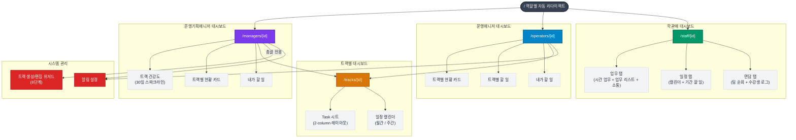
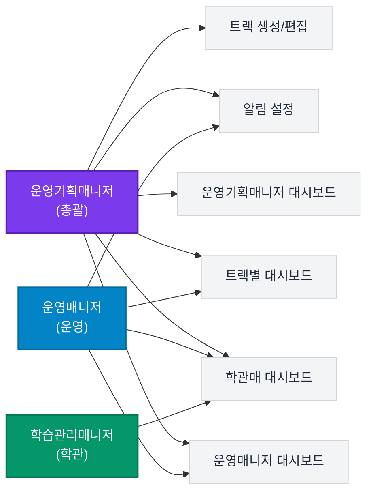
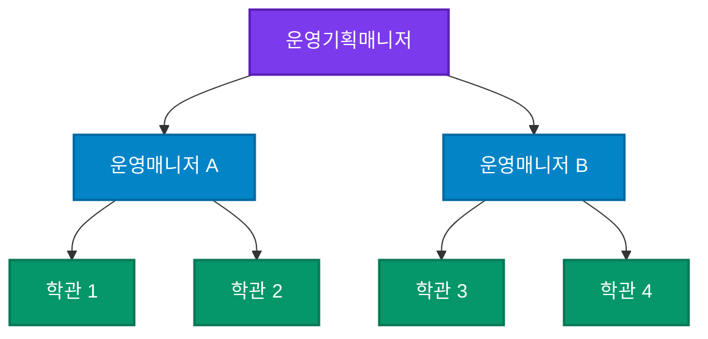

# EduWorks — 페이지 구조도

> GitHub에서 Mermaid 다이어그램이 바로 렌더링됩니다.
> 고해상도가 필요하면 [Mermaid Live Editor](https://mermaid.live)에 코드를 붙여넣어 PNG/SVG로 내보내세요.

---

## 전체 페이지 구조

---

## 역할별 접근 권한

---

## 조직 위임 구조

---

## 위저드 흐름 (트랙 생성 8단계)

