# Context Graph View

> 담당자나 AI 에이전트가 작업 전 "어떤 페이지가 있고, 어떤 문서를 참고해야 하는지" 빠르게 파악하기 위한 매핑 문서.

---

## 1. 라우트-문서 매핑

| 라우트 | 설명 | 참고 문서 |
|--------|------|-----------|
| `/` | 역할별 자동 리다이렉트 | `docs/APP_INFRA.md` |
| `/managers/[id]` | 총괄 대시보드 | `docs/pages/MANAGER_PAGE.md` |
| `/operators/[id]` | 운영매 대시보드 | `docs/pages/MANAGER_PAGE.md` (공용) |
| `/staff/[id]` | 학관 대시보드 (업무/일정/면담) | `docs/pages/STAFF_PAGE.md` |
| `/tracks/[id]` | → `/tracks/[id]/tasks` 리다이렉트 | `docs/pages/TRACK_PAGE.md` |
| `/tracks/[id]/tasks` | 트랙 Task 시트 | `docs/pages/TRACK_PAGE.md` |
| `/tracks/[id]/schedule` | 트랙 일정 캘린더 | `docs/pages/TRACK_PAGE.md` |
| `/admin` | 시스템 관리 메뉴 | (TODO: ADMIN_PAGE.md) |
| `/admin/tracks/new` | 트랙 생성 위저드 (8단계) | (TODO: ADMIN_PAGE.md) |
| `/admin/tracks/edit` | 트랙 수정 선택 | (TODO: ADMIN_PAGE.md) |
| `/admin/tracks/[id]/edit` | 트랙 편집 | (TODO: ADMIN_PAGE.md) |
| `/admin/notifications` | 알림 설정 | `docs/NOTIFICATION_POLICY.md` |
| `/debug/tasks` | Task 컴포넌트 디버그 | `docs/APP_INFRA.md` |

### 글로벌 컴포넌트

| 컴포넌트 | 마운트 위치 | 참고 문서 |
|----------|-----------|-----------|
| `FloatingCommWidget` | `app/layout.tsx` (모든 페이지) | `docs/pages/COMM_WIDGET.md` |
| `AppShell` + `AppSidebar` | `app/layout.tsx` | `docs/APP_INFRA.md` |
| `DebugRoleSwitcher` | `AppShell` 상단 | `docs/APP_INFRA.md` |
| `Toaster` (sonner) | `app/layout.tsx` | — |

---

## 2. 아키텍처 다이어그램

```mermaid
graph TB
    subgraph layout [app/layout.tsx]
        AppShell
        FloatingCommWidget
        Toaster
    end

    subgraph pages [페이지]
        RootPage["/"]
        ManagerPage["/managers/[id]"]
        OperatorPage["/operators/[id]"]
        StaffPage["/staff/[id]"]
        TrackLayout["/tracks/[id] layout"]
        TrackTasks["/tracks/[id]/tasks"]
        TrackSchedule["/tracks/[id]/schedule"]
        AdminHome["/admin"]
        AdminNew["/admin/tracks/new"]
        AdminEdit["/admin/tracks/[id]/edit"]
        AdminNotif["/admin/notifications"]
        DebugTasks["/debug/tasks"]
    end

    subgraph docs [정책 문서]
        AppInfra["APP_INFRA.md"]
        ManagerDoc["pages/MANAGER_PAGE.md"]
        StaffDoc["pages/STAFF_PAGE.md"]
        TrackDoc["pages/TRACK_PAGE.md"]
        CommDoc["pages/COMM_WIDGET.md"]
        TaskModel["TASK_MODEL.md"]
        NotifPolicy["NOTIFICATION_POLICY.md"]
        ProjectCtx["PROJECT_CONTEXT.md"]
    end

    RootPage -->|리다이렉트| AppInfra
    ManagerPage --> ManagerDoc
    OperatorPage --> ManagerDoc
    StaffPage --> StaffDoc
    TrackLayout --> TrackDoc
    TrackTasks --> TrackDoc
    TrackSchedule --> TrackDoc
    FloatingCommWidget --> CommDoc
    AppShell --> AppInfra
    AdminNotif --> NotifPolicy

    ManagerDoc --> TaskModel
    StaffDoc --> TaskModel
    TrackDoc --> TaskModel
    CommDoc --> AppInfra
    CommDoc --> NotifPolicy
    ManagerDoc --> NotifPolicy
```

---

## 3. 컴포넌트 디렉토리 맵

### components/manager/ — 총괄/운영 대시보드

| 파일 | export | 용도 |
|------|--------|------|
| `manager-dashboard-home.tsx` | `ManagerDashboardHome` | 총괄 진입점 |
| `manager-overview.tsx` | `ManagerOverview` | 메인 레이아웃 (역할 prop으로 분기) |
| `track-health-section.tsx` | `TrackHealthSection` | 30일 건강도 스파크라인 |
| `track-stats-section.tsx` | `TrackStatsSection` | 트랙별 현황 카드 |
| `track-action-section.tsx` | `TrackActionSection` | 트랙별 할 일 (운영매 전용) |
| `track-action-card.tsx` | `TrackActionCard` | 액션 토글 카드 |
| `my-task-section.tsx` | `MyTaskSection` | 내가 할 일 시트 |
| `manager-sidebar.tsx` | `ManagerSidebar` | (미사용 — 앱 사이드바로 통합됨) |

### components/operator/ — 운영매 전용

| 파일 | export | 용도 |
|------|--------|------|
| `operator-dashboard-home.tsx` | `OperatorDashboardHome` | 운영매 진입점 |

### components/dashboard/ — 학관 대시보드 위젯

| 파일 | export | 용도 |
|------|--------|------|
| `header.tsx` | `DashboardHeader` | 헤더 (탭/날짜/통계/업무 생성) |
| `time-panel.tsx` | `TimePanel` | 시간 지정 업무 패널 |
| `today-panel.tsx` | `TodayPanel` | 업무 리스트 패널 |
| `comm-channel.tsx` | `CommChannel` | 소통 채널 (학관 전용) |
| `schedule-right-panel.tsx` | `ScheduleRightPanel` | 일정 오른쪽 패널 |
| `week-calendar.tsx` | `WeekChapterCalendar` | SharedCalendar re-export |

### components/track/ — 트랙 페이지

| 파일 | export | 용도 |
|------|--------|------|
| `track-task-sheet.tsx` | `TrackTaskSheet` | Task 시트 (2-column) |
| `track-modals.tsx` | `DeferModal`, `NewTaskModal` 등 | 모달 모음 |
| `track-schedule-create-modal.tsx` | `TrackScheduleCreateModal` | 운영일정/기간Task 생성 |
| `track-utils.ts` | 유틸, 상수 | 색상, 상태 설정 |

### components/task/ — Task 공통

| 파일 | export | 용도 |
|------|--------|------|
| `task-types.ts` | `UnifiedTask`, `TaskStatus` 등 | 타입/enum 정의 |
| `task-card.tsx` | `TaskCard` | compact/card/expanded variant |
| `task-detail-modal.tsx` | `TaskDetailModal` | 상세/채팅/상태변경 |
| `task-adapter.ts` | `trackTaskToUnified` | TrackTask → UnifiedTask 변환 |
| `task-badges.tsx` | `StatusBadge` 등 | 뱃지 컴포넌트 |

### components/calendar/ — 공유 캘린더

| 파일 | export | 용도 |
|------|--------|------|
| `index.tsx` | `SharedCalendar` | 메인 캘린더 (월간/주간) |
| `calendar-types.ts` | 타입, 상수 | FilterKey, LAYER_STYLES |
| `calendar-utils.ts` | `timeToSlot` 등 | 날짜/시간 유틸 |
| `month-view.tsx` | `MonthView` | 월간 뷰 |
| `week-view.tsx` | `WeekView` | 주간 뷰 |
| `all-day-bar.tsx` | `AllDayBarRenderer` | 종일 바 렌더러 |
| `legend-toggle.tsx` | `LegendToggle` | 범례 필터 |

### components/comm/ — 소통 위젯

| 파일 | export | 용도 |
|------|--------|------|
| `floating-comm-widget.tsx` | `FloatingCommWidget` | 글로벌 플로팅 위젯 |

### components/interview/ — 면담

| 파일 | export | 용도 |
|------|--------|------|
| `team-round-panel.tsx` | `TeamRoundPanel` | 팀 순회 체크 |
| `student-log-panel.tsx` | `StudentLogPanel` | 수강생 로그 |

### components/layout/ — 글로벌 레이아웃

| 파일 | export | 용도 |
|------|--------|------|
| `app-shell.tsx` | `AppShell` | 앱 셸 (사이드바 + 메인) |
| `app-sidebar.tsx` | `AppSidebar` | 역할별 네비게이션 |
| `debug-role-switcher.tsx` | `DebugRoleSwitcher` | 역할 전환 디버그 바 |

---

## 4. 데이터 레이어

| Store / 파일 | 용도 | 참고 문서 |
|-------------|------|-----------|
| `lib/admin-store.ts` (`useAdminStore`) | 전역 상태 (트랙, Task, 일정, 소통) | `PROJECT_CONTEXT.md` |
| `lib/role-store.ts` (`useRoleStore`) | 역할 상태 관리 | `APP_INFRA.md` |
| `lib/interview-store.ts` (`useInterviewStore`) | 면담 상태 | `pages/STAFF_PAGE.md` |
| `lib/admin-mock-data.ts` | Mock 데이터 + 타입 정의 | `PROJECT_CONTEXT.md` |
| `lib/date-constants.ts` | 날짜 상수, 유틸 | `APP_INFRA.md` |
| `lib/grid-utils.ts` | 겹침 처리 알고리즘 | `APP_INFRA.md` |

---

## 5. TODO (정책 문서 미작성)

| 대상 | 상태 | 비고 |
|------|------|------|
| Admin 페이지 (트랙 생성/수정) | 기능 구현 미완성 | 구현 완료 후 문서화 |
| ~~알림 시스템 상세 정책~~ | **완료** | `docs/NOTIFICATION_POLICY.md` |
