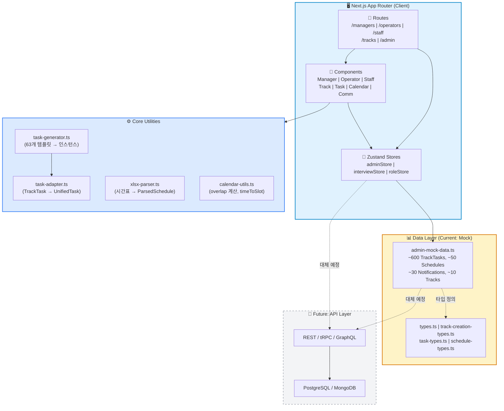
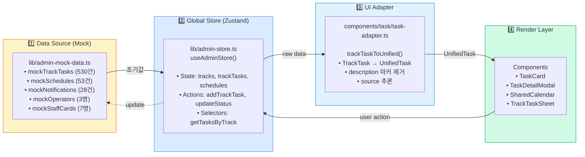
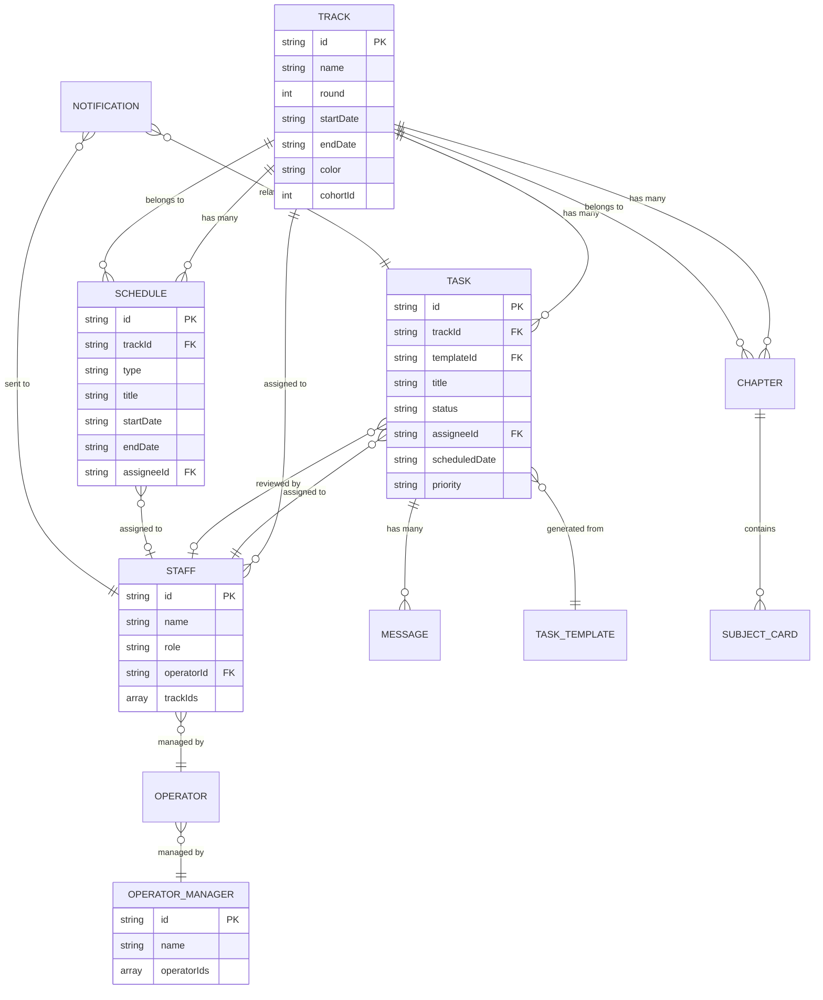
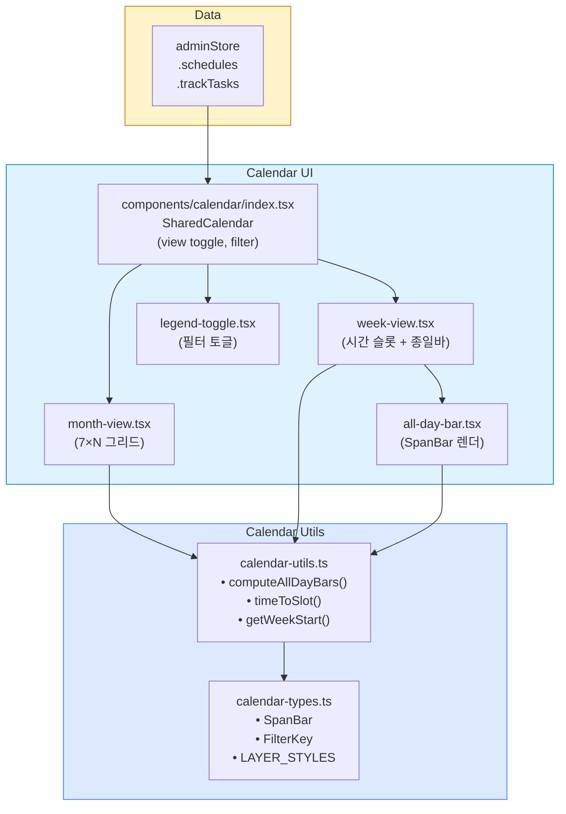
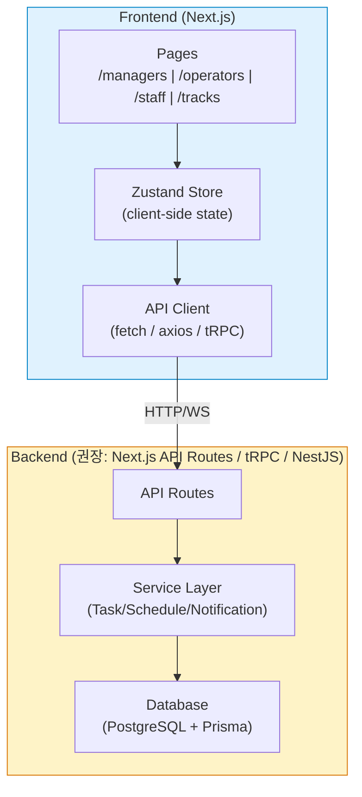

# EduWorks — 프로젝트 전체 아키텍처 (One-Pager)

> **목적**: 학습 트랙 운영 관리 대시보드 시스템의 전체 구조를 한 장으로 이해
> **최종 갱신**: 2026-03-06

---

## 고수준 시스템 아키텍처



---

## 1. Next.js App Router 폴더 구조와 라우팅 맵

### 1.1 라우트 트리

```
app/
├── page.tsx                              → 역할별 자동 리다이렉트 (/managers/mgr1 | /operators/op1 | /staff/staff1)
├── layout.tsx                            → RootLayout (AppShell + FloatingCommWidget + Toaster)
│
├── managers/[id]/page.tsx                → 총괄(operator_manager) 대시보드 (ManagerDashboardHome)
├── operators/[id]/page.tsx               → 운영(operator) 대시보드 (OperatorDashboardHome)
├── staff/[id]/page.tsx                   → 학관(learning_manager) 대시보드 (3탭: 업무/일정/면담)
│
├── tracks/[id]/
│   ├── layout.tsx                        → 공통 헤더 + 네비게이션 탭 (Task/일정)
│   ├── page.tsx                          → redirect → /tracks/[id]/tasks
│   ├── tasks/page.tsx                    → Task 시트 (TrackTaskSheet, 2-column)
│   └── schedule/page.tsx                 → 일정 탭 (SharedCalendar + ScheduleRightPanel)
│
├── admin/
│   ├── page.tsx                          → 시스템 관리 홈
│   ├── tracks/
│   │   ├── new/page.tsx                  → 트랙 생성 위저드 (8단계)
│   │   ├── [id]/edit/page.tsx            → 트랙 편집
│   │   └── edit/page.tsx                 → 트랙 편집 목록
│   └── notifications/page.tsx            → 알림 설정 (역할별 권한)
│
└── debug/tasks/page.tsx                  → 디버그: 전체 Task 목록
```

### 1.2 주요 페이지와 역할

| 라우트 | 역할 | 주요 기능 | 관련 파일 |
|--------|------|----------|----------|
| `/managers/[id]` | 총괄 | • 트랙 건강도 (30일 스파크라인)<br/>• 트랙별 현황 카드<br/>• 내가 할 일 | `components/manager/manager-overview.tsx`<br/>`components/manager/track-health-section.tsx` |
| `/operators/[id]` | 운영 | • 트랙별 현황 카드<br/>• 트랙별 할 일<br/>• 내가 할 일 | `components/manager/manager-overview.tsx` (role='operator') |
| `/staff/[id]` | 학관 | • **업무 탭**: 시간업무 + 리스트 + 소통<br/>• **일정 탭**: 캘린더 + 기간할일<br/>• **면담 탭**: 팀순회 + 수강생로그 | `app/staff/[id]/page.tsx`<br/>`components/dashboard/*` |
| `/tracks/[id]/tasks` | 전체 | • Task 시트 (2-column)<br/>• 담당자 배정/재배정<br/>• 상태 변경 (대기→진행→완료) | `components/track/track-task-sheet.tsx`<br/>`components/task/task-detail-modal.tsx` |
| `/tracks/[id]/schedule` | 전체 | • 월간/주간 캘린더<br/>• 운영일정/기간Task 생성<br/>• 필터 (챕터/과목/운영일정/기간Task) | `components/calendar/index.tsx`<br/>`components/track/track-schedule-create-modal.tsx` |
| `/admin/tracks/new` | 총괄 전용 | • **8단계 위저드**<br/>• 시간표 업로드 → Task 자동 생성<br/>• 학관 배정 (전원/지정/순환) | `components/track-creation/track-creation-wizard.tsx`<br/>`lib/xlsx-parser.ts`<br/>`lib/task-generator.ts` |

---

## 2. 데이터 레이어: Mock → Store → UI Adapter → Render

### 2.1 데이터 흐름 다이어그램



### 2.2 핵심 데이터 타입과 파일

| 타입 | 정의 위치 | 설명 | 주요 필드 |
|------|----------|------|----------|
| `TrackTask` | `lib/admin-mock-data.ts` | 스토어 원본 Task 타입 (18필드) | `id`, `trackId`, `title`, `status`, `assigneeId`, `scheduledDate`, `messages` |
| `UnifiedTask` | `components/task/task-types.ts` | UI 렌더링용 통합 Task (22필드) | `source`, `startDate`, `endDate`, `startTime`, `priority`, `messages` |
| `UnifiedSchedule` | `components/schedule/schedule-types.ts` | 일정 통합 타입 (13필드) | `type`, `title`, `color`, `startDate`, `endDate`, `assigneeId` |
| `TaskTemplateConfig` | `lib/track-creation-types.ts` | Task 템플릿 (63개) | `frequency`, `driRole`, `triggerType`, `priority`, `scope` |
| `GeneratedTask` | `lib/track-creation-types.ts` | 생성된 Task 인스턴스 | `templateId`, `assigneeId`, `scheduledDate`, `chapterId` |

### 2.3 Adapter 규칙 (`task-adapter.ts`)

```typescript
// TrackTask → UnifiedTask 변환 로직
export function trackTaskToUnified(tt: TrackTask): UnifiedTask {
  return {
    source: mapSource(tt),          // description 마커로 추론 (__self_added__ → 'self')
    status: mapStatus(tt.status),   // 'pending' | 'in_progress' | 'completed' | 'overdue' | 'review_requested'
    priority: tt.priority ?? (tt.status === 'overdue' ? 'urgent' : 'normal'),
    startDate: tt.scheduledDate,
    endDate: tt.endDate,
    startTime: tt.scheduledTime,
    endTime: tt.dueTime,
    description: cleanDescription(tt.description),  // 마커 제거
    messages: tt.messages.map(m => ({ ...m, isSelf: m.isSelf })),
    // ... 나머지 필드
  }
}
```

**주요 마커**:
- `__self_added__`: 학관이 직접 추가한 Task (source='self')
- `__request_sent__`: 운영이 보낸 요청 (source='request_sent')

---

## 3. 핵심 도메인: Track/Task/Schedule/Staff/Manager/Operator/Admin/Comm

### 3.1 도메인 관계도



### 3.2 위젯 관계도

| 위젯 | 위치 | 주요 기능 | 데이터 소스 |
|------|------|----------|------------|
| **Track Health** | 총괄 대시보드 | 30일 스파크라인 (완료율) | `adminStore.trackTasks` |
| **Track Stats** | 총괄/운영 대시보드 | 트랙별 KPI 카드 | `adminStore.trackTasks` |
| **Track Action** | 운영 대시보드 | 트랙별 할 일 (3컬럼 토글) | `adminStore.trackTasks` |
| **My Task** | 총괄/운영 대시보드 | 내가 할 일 (UnifiedTask) | `adminStore.managerTasks` |
| **Time Panel** | 학관 대시보드 | 시간 지정 업무 (좌 25%) | `adminStore.trackTasks` |
| **Today Panel** | 학관 대시보드 | 업무 리스트 (좌 25%) | `adminStore.trackTasks` |
| **Comm Channel** | 학관 대시보드 | 소통 채널 (우 50%) | `adminStore.commMessages` |
| **Floating Comm** | 글로벌 (총괄/운영) | 플로팅 위젯 (알림/채팅/Sticky) | `adminStore.commNotifications`<br/>`adminStore.commMessages` |
| **Calendar** | 일정 탭 | 월간/주간 캘린더 | `adminStore.schedules` |
| **Task Sheet** | 트랙 Task 탭 | 2-column Task 시트 | `adminStore.trackTasks` |

---

## 4. Track Creation Wizard (8 Steps) 플로우

### 4.1 위저드 단계

```mermaid
graph LR
    S1["1️⃣ 기본 정보<br/>(name, round)"]
    S2["2️⃣ 시간표 업로드<br/>(xlsx → ParsedSchedule)"]
    S3["3️⃣ 챕터 편성<br/>(SubjectCard → Chapter)"]
    S4["4️⃣ 인원 배정<br/>(StaffMember 선택)"]
    S5["5️⃣ Task 생성<br/>(템플릿 → 인스턴스)"]
    S6["6️⃣ 담당자 배정<br/>(전원/지정/순환)"]
    S7["7️⃣ Task 확인<br/>(생성된 Task 미리보기)"]
    S8["8️⃣ 최종 확인<br/>(adminStore에 저장)"]

    S1 --> S2 --> S3 --> S4 --> S5 --> S6 --> S7 --> S8

    style S5 fill:#FEF3C7,stroke:#D97706,stroke-width:3px
    style S6 fill:#FEF3C7,stroke:#D97706,stroke-width:3px
```



### 4.2 관련 모듈

| 모듈 | 파일 | 역할 | 핵심 함수 |
|------|------|------|----------|
| **위저드 메인** | `components/track-creation/track-creation-wizard.tsx` | 8단계 상태 관리, 네비게이션 | `handleNext()`, `handlePrev()`, `canGoNext()` |
| **XLSX 파서** | `lib/xlsx-parser.ts` | 엑셀 시간표 → `ParsedSchedule` | `parseExcelSchedule(file)` → `{ cards, holidays, trackStart, trackEnd }` |
| **Task 생성기** | `lib/task-generator.ts` | 템플릿 → 인스턴스 생성 | `generateTasks(trackStart, trackEnd, chapters, recurrenceConfigs)` |
| **템플릿 정의** | `lib/task-templates.ts` | 63개 Task 템플릿 | `taskTemplates: TaskTemplateConfig[]` |
| **배정 로직** | `lib/task-generator.ts` | 학관 배정 (전원/지정/순환) | `suggestDefaultAssignments()`, `applyAssignments()` |

### 4.3 Task 생성 로직 요약

```typescript
// lib/task-generator.ts
export function generateTasks(
  trackStart: string,
  trackEnd: string,
  chapters: Chapter[],
  recurrenceConfigs: Record<string, RecurrenceConfig>,
): GeneratedTask[] {
  const tasks: GeneratedTask[] = []

  for (const tpl of taskTemplates) {  // 63개 템플릿
    switch (tpl.frequency) {
      case 'once':         tasks.push(createOnceTask(tpl, start, end)); break
      case 'per_chapter':  chapters.forEach(ch => tasks.push(createChapterTask(tpl, ch))); break
      case 'daily':        tasks.push(...createRecurringTasks(tpl, rc, start, end)); break
      case 'weekly':       tasks.push(...createRecurringTasks(tpl, rc, start, end)); break
      case 'monthly':      tasks.push(...createRecurringTasks(tpl, rc, start, end)); break
      case 'ad_hoc':       // 수동 생성만 허용
    }
  }

  return tasks  // 전체 기간 동안 ~200~600개 생성
}
```

**빈도별 인스턴스 수**:
- `daily` (5개 템플릿): 트랙 기간 60일 → 60개씩 = 300개
- `weekly` (15개): 60일 ÷ 7 = 8주 → 15 × 8 = 120개
- `per_chapter` (10개): 챕터 5개 → 10 × 5 = 50개
- `once` (20개): 20개
- `monthly` (8개): 60일 ÷ 30 = 2개월 → 8 × 2 = 16개
- **합계**: ~506개 (트랙당)

---

## 5. Calendar 렌더링 구조

### 5.1 Calendar 아키�ecture



### 5.2 Overlap 계산 알고리즘 (`computeAllDayBars`)

```typescript
// components/calendar/calendar-utils.ts
export function computeAllDayBars(
  chapters: { id, label, startDate, endDate }[],
  curricula: { ... }[],
  opPeriods: { ... }[],
  periodTasks: { ... }[],
  weekDays: Date[],
): SpanBar[] {
  const bars: SpanBar[] = []
  let globalRow = 0

  // 1️⃣ 챕터 (한 줄 고정)
  for (const ch of chapters) {
    const [startCol, endCol] = findCols(ch.startDate, ch.endDate)
    bars.push({ id: ch.id, label: ch.label, layer: 'chapter', startCol, span: endCol - startCol + 1, row: globalRow })
  }
  if (chapters.length > 0) globalRow++

  // 2️⃣ 과목/운영/기간Task (겹침 감지하여 자동 row 배치)
  const placeRows = (items, layer) => {
    const rowEnds: number[] = []  // 각 row의 마지막 컬럼 추적
    for (const item of items) {
      const [startCol, endCol] = findCols(item.startDate, item.endDate)
      let row = 0
      // 겹치지 않는 row 찾기
      while (row < rowEnds.length && rowEnds[row] > startCol) row++
      if (row >= rowEnds.length) rowEnds.push(0)
      rowEnds[row] = endCol + 1
      bars.push({ id: item.id, label: item.label, layer, startCol, span: endCol - startCol + 1, row: globalRow + row })
    }
    globalRow += Math.max(rowEnds.length, 0)
  }

  placeRows(curricula, 'curriculum')
  placeRows(opPeriods, 'operation')
  placeRows(periodTasks, 'period_task')

  return bars
}
```

**핵심 로직**:
- `findCols()`: `startDate`와 `endDate`가 주간 범위 내에 포함되는 컬럼 인덱스 계산
- `rowEnds[]`: 각 row의 마지막 컬럼을 추적하여 겹침 감지
- 겹치면 다음 row로 이동, 안 겹치면 같은 row에 배치

### 5.3 시간 슬롯 계산 (`timeToSlot`)

```typescript
// 09:00 ~ 21:00 → 0~24 슬롯 (30분 단위)
export function timeToSlot(time: string, hourStart = 9, hourEnd = 21): number {
  const totalSlots = (hourEnd - hourStart) * 2  // 24
  const [h, m] = time.split(':').map(Number)
  return Math.max(0, Math.min(totalSlots, (h - hourStart) * 2 + Math.floor(m / 30)))
}

// 예시
timeToSlot('09:00', 9, 21) // 0
timeToSlot('10:30', 9, 21) // 3
timeToSlot('21:00', 9, 21) // 24
```

### 5.4 주요 유틸 함수

| 함수 | 파일 | 설명 |
|------|------|------|
| `computeAllDayBars()` | `calendar-utils.ts` | 종일 바 겹침 계산 (챕터/과목/운영/기간Task) |
| `timeToSlot()` | `calendar-utils.ts` | 시간 문자열 → 슬롯 인덱스 (30분 단위) |
| `getWeekStart()` | `calendar-utils.ts` | 주간 시작일 (월요일) 계산 |
| `getMonthStart()` | `calendar-utils.ts` | 월간 시작일 계산 |
| `isSameDay()` | `calendar-utils.ts` | 두 날짜가 같은지 비교 |
| `isInRange()` | `calendar-utils.ts` | 날짜가 범위 내에 있는지 확인 |
| `fmtShortRange()` | `calendar-utils.ts` | 날짜 범위 포맷팅 (3/1~3/5) |

---

## 6. 현재 상태 및 API 경계

### 6.1 현재 상태: 전부 Mock

✅ **현재**: 모든 데이터가 `lib/admin-mock-data.ts`에서 제공
✅ **동적 날짜**: `_d(offset)` 헬퍼로 "오늘" 기준 상대 날짜 생성
✅ **규모**: ~600개 Task, ~50개 Schedule, ~30개 Notification

| 데이터 | 건수 | 생성 범위 | 비고 |
|--------|------|----------|------|
| TrackTasks | ~530건 | 오늘 기준 과거 10일 ~ 미래 30일 (매 평일) | `_genExtTasks()` |
| Schedules | ~53건 | 3개 트랙 전체 기간 | chapter/curriculum/operation/event/personal |
| Notifications | ~28건 | — | SYS/ACT/THR 전체 타입 커버 |
| ManagerTasks | 10건 | — | 총괄/운영 개인 업무 |
| Comm Messages | ~30건 | — | 8개 채널 |
| Staff Cards | 7건 | — | 전체 학관 상세 |
| Interview Students | 57명 | — | 10팀 |

### 6.2 자연스러운 API 경계



#### 권장 API 엔드포인트 (RESTful 예시)

| 엔드포인트 | Method | 설명 | 권한 |
|-----------|--------|------|------|
| `/api/tracks` | GET | 트랙 목록 조회 | 전체 |
| `/api/tracks/:id` | GET | 트랙 상세 조회 | 전체 |
| `/api/tracks` | POST | 트랙 생성 (위저드) | 총괄 |
| `/api/tracks/:id` | PATCH | 트랙 수정 | 총괄 |
| `/api/tracks/:id/tasks` | GET | 트랙 Task 목록 | 전체 |
| `/api/tasks/:id` | PATCH | Task 상태 변경 (대기→진행→완료) | 배정자 |
| `/api/tasks/:id/assign` | POST | Task 담당자 배정 | 운영/총괄 |
| `/api/tasks/:id/messages` | POST | Task 메시지 추가 | 전체 |
| `/api/schedules` | GET | 일정 목록 (trackId, startDate, endDate) | 전체 |
| `/api/schedules` | POST | 운영일정/기간Task 생성 | 운영/총괄 |
| `/api/notifications` | GET | 알림 목록 (recipientId) | 본인 |
| `/api/notifications/:id/read` | POST | 알림 읽음 처리 | 본인 |
| `/api/staff/:id/tasks` | GET | 학관 개인 Task 목록 | 본인/운영/총괄 |
| `/api/comm/messages` | GET | 소통 메시지 (channelId) | 참여자 |
| `/api/comm/messages` | POST | 메시지 전송 | 참여자 |

#### 권장 기술 스택 (Backend)

| 카테고리 | 권장 기술 | 이유 |
|---------|-----------|------|
| API Framework | **Next.js API Routes** (MVP) or **tRPC** (확장성) or **NestJS** (엔터프라이즈) | Next.js 프로젝트와 자연스럽게 통합 |
| ORM | **Prisma** | TypeScript 친화, 마이그레이션 관리 편리 |
| Database | **PostgreSQL** | 관계형 데이터 구조, 복잡한 쿼리 지원 |
| Auth | **NextAuth.js** or **Clerk** | 역할 기반 인증/인가 (operator_manager, operator, learning_manager) |
| Real-time | **Socket.io** or **WebSocket** (선택) | 소통 위젯, 실시간 알림 |
| File Upload | **AWS S3** or **Cloudflare R2** | 시간표 엑셀, 첨부파일 |
| Queue | **BullMQ** (선택) | Task 생성, 알림 발송 비동기 처리 |

---

## 7. 다음 확장 포인트

### 7.1 백엔드 연동 우선순위 (Phase 1~3)

#### Phase 1: 인증 및 Core CRUD (Week 1~2)

```
✅ 1. 인증 시스템 구축 (NextAuth.js + PostgreSQL)
   • User 테이블 (id, name, email, role, operatorId, trackIds)
   • 세션 기반 인증, 역할별 권한 체크

✅ 2. Track CRUD API
   • GET /api/tracks (목록)
   • GET /api/tracks/:id (상세)
   • POST /api/tracks (생성 — 위저드 데이터 저장)
   • PATCH /api/tracks/:id (수정)

✅ 3. Task 조회 API
   • GET /api/tracks/:id/tasks (트랙별 Task 목록)
   • GET /api/staff/:id/tasks (학관 개인 Task)
```

#### Phase 2: Task 상태 관리 및 배정 (Week 3~4)

```
✅ 4. Task 상태 변경 API
   • PATCH /api/tasks/:id (status: pending → in_progress → completed)
   • PATCH /api/tasks/:id/defer (연기)
   • POST /api/tasks/:id/review (확인 요청)

✅ 5. Task 배정 API
   • POST /api/tasks/:id/assign (담당자 배정)
   • POST /api/tasks/:id/reassign (재배정)

✅ 6. Task 메시지 API
   • GET /api/tasks/:id/messages
   • POST /api/tasks/:id/messages (채팅 추가)
```

#### Phase 3: 일정/알림/소통 (Week 5~6)

```
✅ 7. Schedule API
   • GET /api/schedules (일정 목록)
   • POST /api/schedules (운영일정/기간Task 생성)
   • PATCH /api/schedules/:id (수정)
   • DELETE /api/schedules/:id (삭제)

✅ 8. Notification API
   • GET /api/notifications (내 알림)
   • POST /api/notifications/:id/read (읽음 처리)
   • WebSocket 실시간 알림 (선택)

✅ 9. Comm API
   • GET /api/comm/channels (채널 목록)
   • GET /api/comm/messages (메시지 목록)
   • POST /api/comm/messages (메시지 전송)
   • POST /api/comm/stickies (Sticky 메모 생성)
```

### 7.2 기능 확장 로드맵

| 단계 | 기능 | 설명 | 예상 공수 |
|------|------|------|-----------|
| **Phase 4** | **면담 시스템** | • 팀 순회 체크 API<br/>• 수강생 로그 저장<br/>• 연속 결석 알림 | 1주 |
| **Phase 5** | **알림 자동화** | • Task 기한 임박 알림<br/>• 에스컬레이션 (운영 미조치 → 총괄)<br/>• 긴급 Task 생성 시 즉시 알림 | 1주 |
| **Phase 6** | **대시보드 KPI** | • 트랙 건강도 실시간 계산<br/>• 완료율/이슈처리율/운영매 완료율 API | 3일 |
| **Phase 7** | **검색/필터** | • Task 검색 (제목, 카테고리, 담당자)<br/>• 일정 필터 (챕터, 과목, 운영일정) | 3일 |
| **Phase 8** | **파일 업로드** | • 시간표 엑셀 업로드 (S3)<br/>• Task 첨부파일 (S3) | 3일 |
| **Phase 9** | **권한 세분화** | • 트랙별 접근 권한<br/>• Task 수정 권한 (배정자만) | 2일 |
| **Phase 10** | **감사 로그** | • Task 변경 이력<br/>• 로그인 이력<br/>• API 호출 로그 | 3일 |

### 7.3 성능 최적화 포인트

1. **Pagination**: Task 목록 (현재 530건) → 페이지당 50건
2. **Index**: `tasks(trackId, scheduledDate)`, `schedules(trackId, startDate)`
3. **Cache**: 트랙 목록 (Redis), 알림 (10분 TTL)
4. **Lazy Load**: 캘린더 데이터 (주간/월간 범위만 fetch)
5. **Optimistic Update**: Task 상태 변경 시 UI 즉시 반영, API 실패 시 rollback

---

## 8. 요약: 주요 파일 및 책임

### 8.1 Data Layer (Mock → API)

| 파일 | 타입 정의 | Mock 데이터 | 교체 방법 |
|------|-----------|-------------|----------|
| `lib/admin-mock-data.ts` | ✅ 유지 | ❌ 제거 | 타입만 유지, mock* 상수 삭제 |
| `lib/admin-store.ts` | — | — | 초기값을 API fetch로 변경, 액션에 API 호출 추가 |
| `lib/interview-mock-data.ts` | ✅ 유지 | ❌ 제거 | API 연동 |
| `lib/task-templates.ts` | ✅ 유지 (DB 시드) | — | 그대로 사용 |

### 8.2 Core Business Logic (유지)

| 파일 | 설명 | 변경 필요 |
|------|------|----------|
| `lib/task-generator.ts` | Task 생성 로직 (템플릿 → 인스턴스) | 백엔드로 이전 가능 |
| `lib/xlsx-parser.ts` | 엑셀 시간표 파싱 | 그대로 사용 or 백엔드로 이전 |
| `components/task/task-adapter.ts` | TrackTask → UnifiedTask 변환 | 그대로 사용 |
| `components/calendar/calendar-utils.ts` | 캘린더 유틸 (overlap 계산) | 그대로 사용 |

### 8.3 UI Components (유지)

| 카테고리 | 주요 파일 | 설명 |
|---------|----------|------|
| **Manager** | `components/manager/*` | 총괄/운영 대시보드 (건강도, 현황, 할 일) |
| **Staff** | `components/dashboard/*` | 학관 대시보드 (업무/일정/면담) |
| **Track** | `components/track/*` | Task 시트, 일정 캘린더 |
| **Task** | `components/task/*` | TaskCard, TaskDetailModal, task-adapter |
| **Calendar** | `components/calendar/*` | SharedCalendar, month-view, week-view |
| **Comm** | `components/comm/*` | FloatingCommWidget (알림/채팅/Sticky) |
| **Interview** | `components/interview/*` | 팀 순회, 수강생 로그 |
| **Track Creation** | `components/track-creation/*` | 8단계 위저드 |

---

## 9. 결론

### 핵심 설계 원칙 (재확인)

1. **단일 데이터 소스**: `useAdminStore()` (Zustand) — 모든 컴포넌트가 스토어를 참조
2. **어댑터 패턴**: `TrackTask` → `UnifiedTask` 변환으로 UI 레이어 격리
3. **동적 Mock 데이터**: `_d(offset)` 헬퍼로 "오늘" 기준 상대 날짜 생성 → 언제 실행해도 일관성 유지
4. **템플릿 기반 Task**: 63개 템플릿 → 빈도/트리거에 따라 자동 생성 → ~500개 인스턴스
5. **겹침 감지 알고리즘**: `computeAllDayBars()`로 캘린더 종일 바 자동 배치
6. **역할 기반 권한**: 총괄 → 운영 → 학관 위임 구조, 각 역할별 UI/권한 분리

### 백엔드 개발 시작점

1. **Phase 1부터 순서대로**: 인증 → Track CRUD → Task 조회
2. **타입 정의는 재사용**: `lib/admin-mock-data.ts`의 interface를 DB 스키마로 변환
3. **Mock 제거는 마지막**: API 구축 후 `lib/admin-store.ts` 초기값만 변경
4. **Task 생성 로직은 백엔드로**: `lib/task-generator.ts`를 API 엔드포인트로 이전

### 문서 참고 순서 (개발자용)

1. **전체 맥락**: `docs/PROJECT_CONTEXT.md` (프로젝트 목적, 역할, 기술 스택)
2. **데이터 모델**: `docs/TASK_MODEL.md` (UnifiedTask 22필드, 상태 전환)
3. **페이지별 기능**: `docs/pages/*.md` (MANAGER_PAGE, STAFF_PAGE, TRACK_PAGE, COMM_WIDGET)
4. **시스템 정책**: `docs/NOTIFICATION_POLICY.md`, `TASK_SYSTEM_POLICY.md`
5. **아키텍처 다이어그램**: `docs/ARCHITECTURE_DIAGRAM.md` (페이지 구조도, 위저드 플로우)
6. **이 문서**: `docs/FULL_ARCHITECTURE.md` (전체 아키텍처 One-Pager)

---

**문서 종료** — 추가 질문은 `docs/` 디렉토리의 각 전문 문서를 참고하세요.
